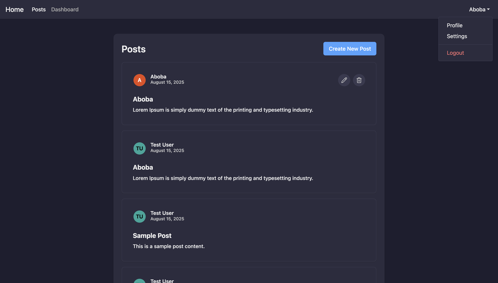

# Laravel + React

Single Page Application with Laravel backend and React frontend for managing posts and users.

## Technologies

- Laravel 12
- React 19
- Zustand

## Installation

### Backend (Laravel)
```bash
composer install
cp .env.example .env
php artisan key:generate
php artisan migrate --seed
php artisan serve
```

### Frontend (React)
```bash
npm install
npm run dev
```

## Screenshots

### Home



## Implemented

**Backend:**
- RESTful API
- Authentication via Sanctum
- CRUD operations for posts
- Validation and error handling
- Seeders for test data
- Simple dashboard

**Frontend:**
- React Router navigation
- Bootstrap template integration
- Forms with validation
- Pagination
- Color scheme change
- API integration
